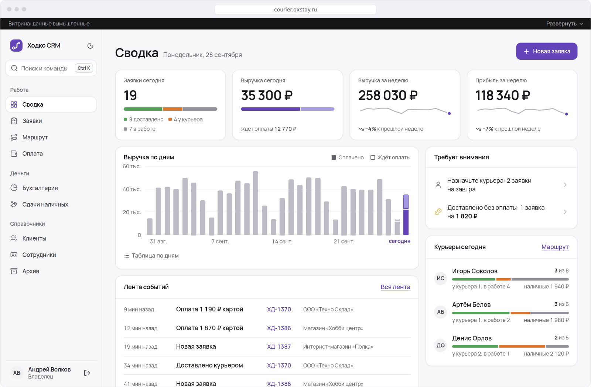

# Ходко CRM

CRM для курьерской службы: заявки, курьеры, маршруты и деньги в одной системе.

### [Открыть систему »](https://courier.qxstay.ru)

Витрина на основе реального проекта. Данные вымышленные, вход в один клик.

## Зачем она понадобилась

Служба росла, а заявки приходили в чаты и Google-таблицы. Где сейчас заказ, узнавали звонком курьеру, а наличные и выплаты курьерам сводили вручную каждый вечер.

## Что изменилось

- **Все заявки в одном окне.** У каждой есть курьер и понятный статус.
- **Курьер работает с телефона.** Он ведёт маршрут, а офис сразу видит «Забрал» и «Доставил».
- **Наличные под контролем.** Курьер сдаёт деньги, владелец подтверждает сдачу.
- **Деньги считаются сами.** Выручка, расходы и зарплаты курьеров за день и месяц.

Для разработчиков: что в коде

- `app/demo/dataset.py`: живые данные витрины. Два с половиной месяца истории и сегодняшний день строятся от текущей даты, с правдоподобными адресами, оплатами и маршрутами.
- `app/demo/reset.py`: автопилот. Данные обновляются сами утром, в тишине и не реже раза в 6 часов, одна пересборка за раз.
- `app/demo/world.py`: открытые вкладки после обновления данных спокойно возвращаются на стартовый экран, без ошибок.
- `app/demo/guard.py`: учётные записи витрины нельзя сломать, пароль, роль и доступ защищены.
- `app/ui/day_timeline.py`: «День курьеров», шкала дня по отметкам «забрал» и «доставил».
- `app/templates/couriers/_route_screen.html`: экран маршрута, итоги дня, шкала и карточки курьеров.
- `tests/test_autopilot.py`: проверки автопилота: обновление данных, открытые вкладки, `/health`, лимиты, закреплённые версии.
- `tests/test_demo_dataset.py`: проверки данных: адреса, названия, деньги и маршрут на любой день.
- `tests/test_future_dates.py`: данные на датах через полгода, через год и на стыке годов.
- `Dockerfile`: повторяемая сборка образа на закреплённых версиях.
- `docker-compose.server.yml`: запуск на сервере с лимитами памяти и процессора, перезапуском и ограниченными журналами.
- `deploy/Caddyfile`: HTTPS, заголовки безопасности, сжатие и журнал с ротацией.

Полный код закрыт и показывается по запросу.

Технологии

- Python 3.12, FastAPI, SQLAlchemy 2, Jinja2: страницы собираются на сервере, без тяжёлого фронтенд-фреймворка.
- PostgreSQL 16, миграции Alembic.
- Docker и Caddy: HTTPS, сжатие, заголовки безопасности, закрытие от поисковиков.
- Установка на телефон как приложение (manifest и service worker), светлая и тёмная тема.
- Проверки: unittest, Playwright в Chromium, Firefox и WebKit, Lighthouse.

Обсудить похожую систему: [Telegram](https://t.me/qxstay)
